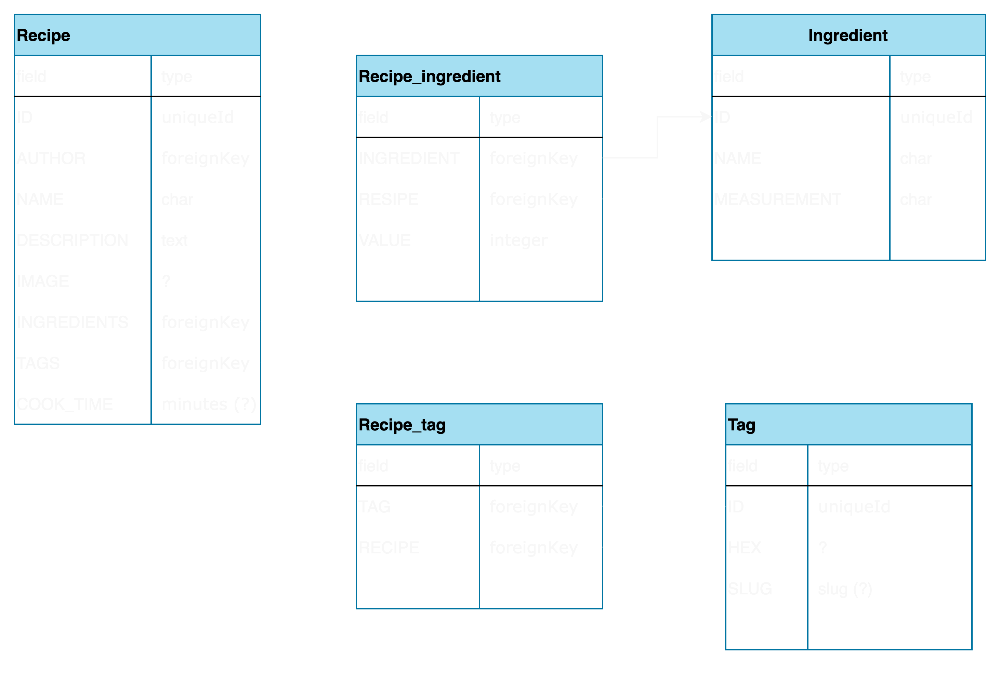
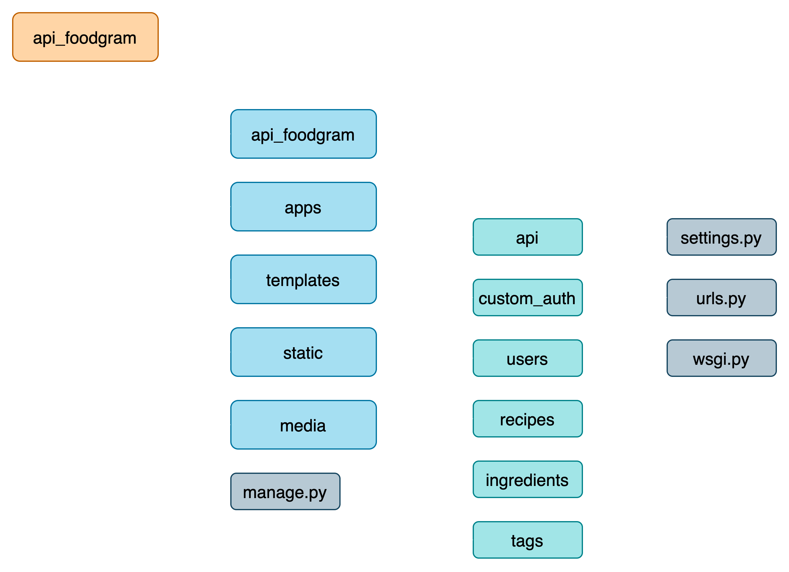

# Foodgram-project

### Информация для ревью

Данные админа:
- email: adm@mail.ru
- password: adm_adm_in

Адрес сайта:
- http://158.160.29.94

## БД проекта:

## Структура приложений API

Проект содержит набор приложений, описаных в папке ***/api***: 
- api
- auth
- users
- recipes
- ingredients
- tags

### Приложение users
Реализует функционал:

### Приложение recipes
Реализует функционал:

### Полный список эндпоинтов проекта:
/api/users/  
/api/users/{id}/  

/api/users/me/  
/api/users/set_password/  

/api/auth/token/login/  
/api/auth/token/logout/  

/api/tags/  
/api/tags/{id}/  

/api/recipes/  
/api/recipes/{id}/  

/api/recipes/download_shopping_cart/  
/api/recipes/{id}/shopping_cart/  
/api/recipes/{id}/favorite/  

/api/users/subscriptions/  
/api/users/{id}/subscribe/  

/api/ingredients/  
/api/ingredients/{id}/  